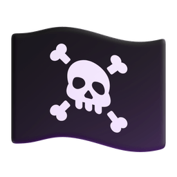

  

#  About Me: 

  
   I'm currently learning new things 
   I'm looking for a new team 
   Interesting fact : [] + [] = ""  
  How much code have I written ?
  

<!-- #  Stay Connect:

 -->

#  Stay Connect:

  

  

  

#  Tech Stack:

  
  

#  GitHub Stats:

|  |  |
| --------------------------------------------------------------------------------------------------------------------------------------------------- | ----------------------------------------------------------------------------------------------------------------------------------------------------------------------------- |

  

